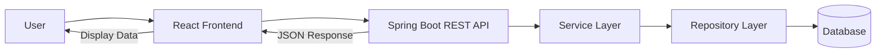
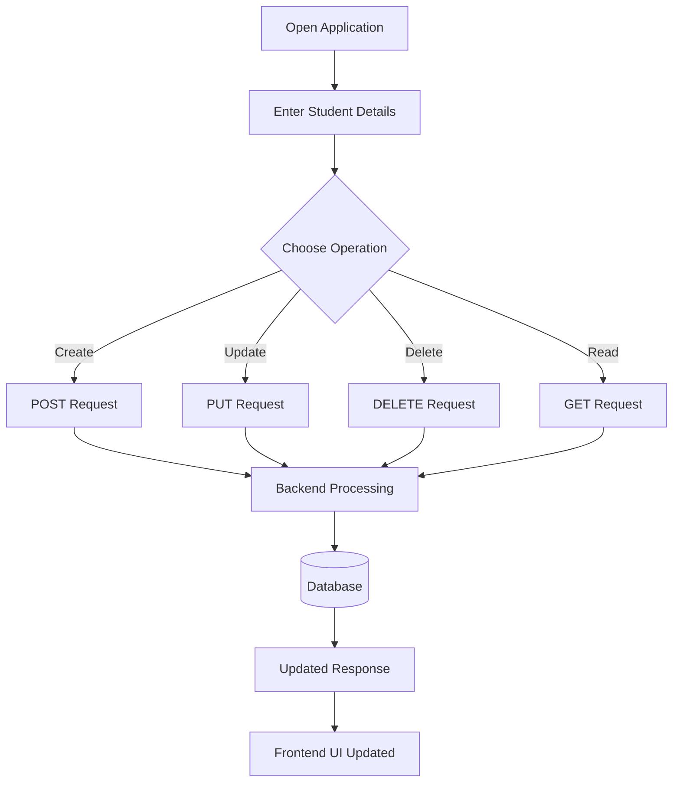

# 🎓 Student Management System

> A modern Full Stack Student Management System built using **React, Java, Spring Boot, REST APIs, and Database Integration** to efficiently manage student records with complete CRUD functionality.

This project demonstrates real-world full stack development concepts including:
- Frontend & Backend Integration
- REST API Development
- State Management
- Database Operations
- CRUD Architecture
- Component-Based UI Design

---

# 🚀 Features

✅ Add New Students  
✅ View Student Records  
✅ Update Existing Data  
✅ Delete Student Records  
✅ REST API Integration  
✅ Responsive UI  
✅ Real-Time Updates  
✅ Clean Component Structure  

---

# 🛠️ Tech Stack

## 💻 Frontend
- React.js
- JSX
- JavaScript
- Vite
- CSS

## ⚙️ Backend
- Java
- Spring Boot
- REST APIs

## 🗄️ Database
- H2 Database / MySQL

## 🔧 Tools
- Git
- GitHub
- Postman
- VS Code
- IntelliJ IDEA

---

# 🏗️ System Architecture



---

# 🔄 CRUD Workflow



---

# 📂 Project Structure

```bash
student-management-system/
│
├── frontend/
│   ├── src/
│   │   ├── App.jsx
│   │   ├── components/
│   │   ├── pages/
│   │   └── main.jsx
│   │
│   ├── package.json
│   └── vite.config.js
│
├── backend/
│   ├── src/main/java/
│   │   ├── controller/
│   │   ├── service/
│   │   ├── repository/
│   │   ├── entity/
│   │   └── StudentManagementApplication.java
│   │
│   └── application.properties
│
└── README.md
```

---

# ⚡ Core Functionalities

## ➕ Add Student
Users can add:
- Student Name
- Course
- Marks

---

## 📋 View Students
Displays all student records dynamically in a table format.

---

## ✏️ Update Student
Allows editing and updating student information instantly.

---

## ❌ Delete Student
Removes student records from the system dynamically.

---

# 🌐 REST API Endpoints

| Method | Endpoint | Description |
|--------|----------|-------------|
| GET | `/students` | Fetch all students |
| POST | `/students` | Add new student |
| PUT | `/students/{id}` | Update student |
| DELETE | `/students/{id}` | Delete student |

---

# ▶️ Running the Project Locally

## 1️⃣ Clone Repository

```bash
git clone https://github.com/janhavinaidu/student-management-app.git
```

---

## 2️⃣ Frontend Setup

```bash
cd frontend
npm install
npm run dev
```

Frontend runs on:

```bash
http://localhost:5173
```

---

## 3️⃣ Backend Setup

```bash
cd backend
```

Run Spring Boot application using:
- IntelliJ IDEA
- VS Code
- Spring Tool Suite (STS)

Backend runs on:

```bash
http://localhost:8080
```

---

# 💡 Key Learning Outcomes

This project helped in gaining practical experience with:

- Full Stack Development
- React State Management
- Java Spring Boot APIs
- CRUD Operations
- REST Architecture
- Frontend & Backend Communication
- Database Integration
- Git & GitHub Workflow
- Component-Based UI Development

---

# 🔥 Future Enhancements

🚀 JWT Authentication  
🚀 Search & Filter Feature  
🚀 Pagination  
🚀 Cloud Deployment  
🚀 Docker Support  
🚀 Admin Dashboard  
🚀 Student Analytics Dashboard  
🚀 Role-Based Authentication  
🚀 Export Data to PDF/Excel  

---

# 👩‍💻 Author

## Janhavi Naidu

📌 AIML Undergraduate | Full Stack & AI Enthusiast

GitHub:  
https://github.com/janhavinaidu

---

# ⭐ Support

If you found this project useful, consider giving it a ⭐ on GitHub!

---

# 📜 License

This project is open-source and available for educational and learning purposes.
